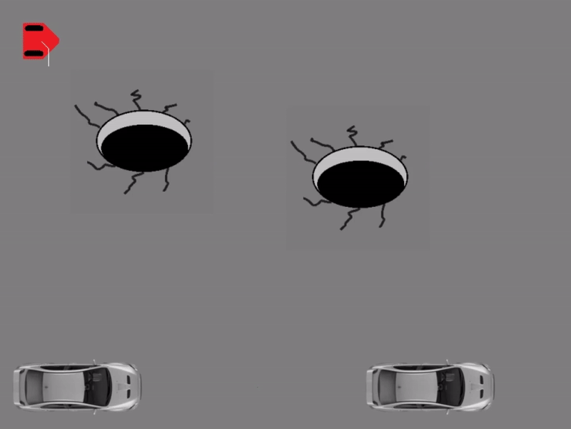

# Mobile Robot Path Planning

This repository contains code to navigate a mobile robot to a goal position. In this case, the goal position is a a parallel parked position. 

Three general vehicles will be tasked to complete this task: a differential drive robot, a car, and a car pulling a trailer.

A full report write up for these simulations can be found in the `docs` folder

The result for the differential drive robot is shown below.

The results for the car is shown below.

The results for the truck is shown below.

